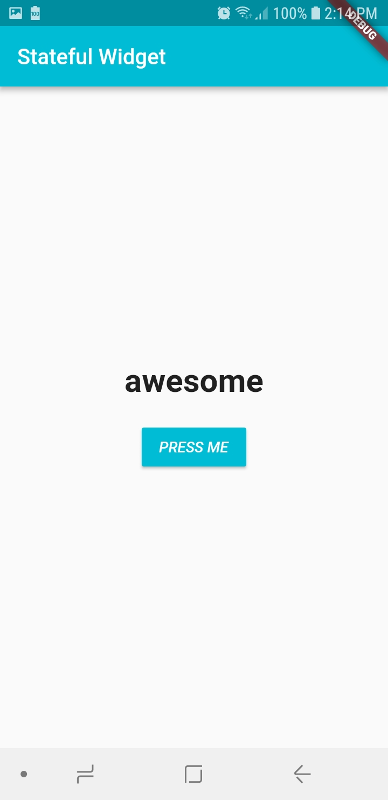

# statefull_widgets

This project is a simple statefull widgets demonstration.

## Screenshots

### References:

[Flutter SDK Tutorial - Buttons & Stateful Widgets!](https://www.youtube.com/watch?v=oKM6BSRZ1-w&list=PLxU9Ryxq6p58PsNmJL70J4_7UzfSqf35n&index=3)