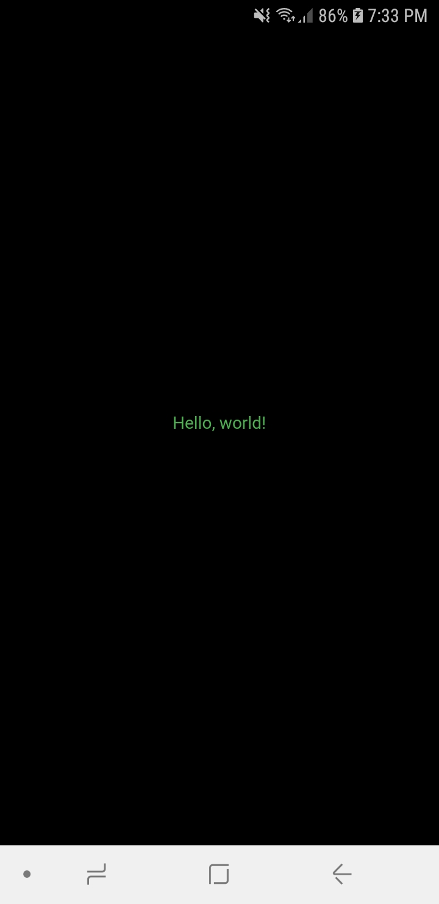

# hello_world

This project is a simple hello world made in flutter.

## Screenshots

### References:

[Flutter SDK Tutorial - Hello World!](https://www.youtube.com/watch?v=CEPCGXQ7IQg&list=PLxU9Ryxq6p58PsNmJL70J4_7UzfSqf35n)