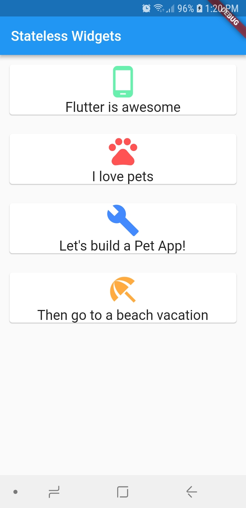

# stateless_widgets

This project is a simple stateless_widgets demonstration.

## Screenshots

### References:

[Flutter SDK Tutorial - Stateless Widgets!](https://www.youtube.com/watch?v=6f1rTeDm9oE&index=2&list=PLxU9Ryxq6p58PsNmJL70J4_7UzfSqf35n)